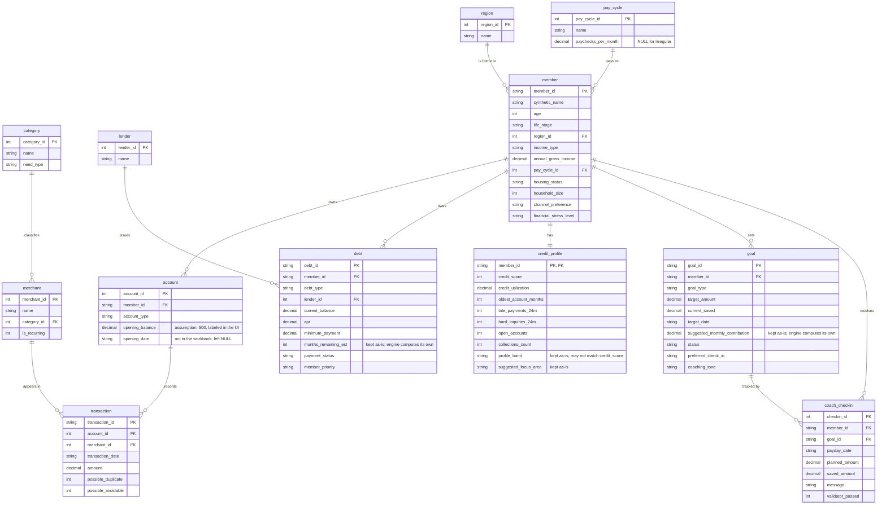

# Normalized schema: ER diagram

Generated by introspecting the actual built database, `data/gesa.db` (`PRAGMA table_info` /
`PRAGMA foreign_key_list` on every table), not hand-typed from the design. Built from the flat
workbook by `scripts/build_db.py` using `scripts/schema.sql`.

**What was removed and why:** only two columns are left out of the base tables, and both are
recomputed losslessly by a view, never lost. `Transaction_Type` is dropped from `transaction`
because it always matches the sign of `amount` (0 mismatches); `Monthly_Net_Income` is dropped
from `member` because it is always exactly `Annual_Gross_Income / 12` (0 mismatches) and the
`v_members` view recomputes it. Category, Need_Type, and Recurring_Flag move off every transaction
row onto `merchant`/`category`, since Merchant determines Category and Category determines
Need_Type (verified 1:1 across all 37 merchants and 13 categories) — repeating them on 12,683 rows
was pure redundancy. Everything the earlier analysis called "wrong or inconsistent"
(`months_remaining_est`, `suggested_monthly_contribution`, `profile_band`, `suggested_focus_area`,
`status`, `member_priority`) is kept on its table exactly as the workbook has it: normalizing never
deletes a value, it only removes what a view can rebuild with zero information loss. `app/engine.py`
computes its own numbers and shows the stored ones alongside them as "needs attention," never using
them.

### Views = the canonical schema

`app/data.py` reads only `v_members`, `v_transactions`, `v_debts`, `v_goals`, `v_accounts` — the
exact canonical columns from `CLAUDE.md`, plus a few nice-to-have extras (`Synthetic_Name`,
`Merchant`, the stored-estimate columns) that later features use for display only. Base tables can
be restructured freely as long as these views keep outputting those columns, spelled exactly this
way.

A rendered PNG of this diagram is at `docs/er_diagram.png`, for the slides.
